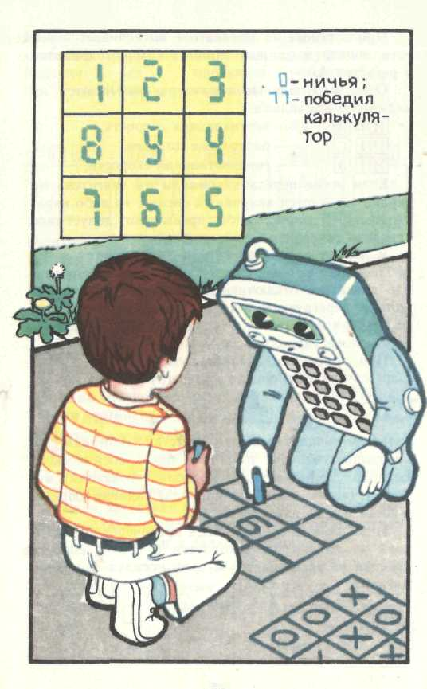
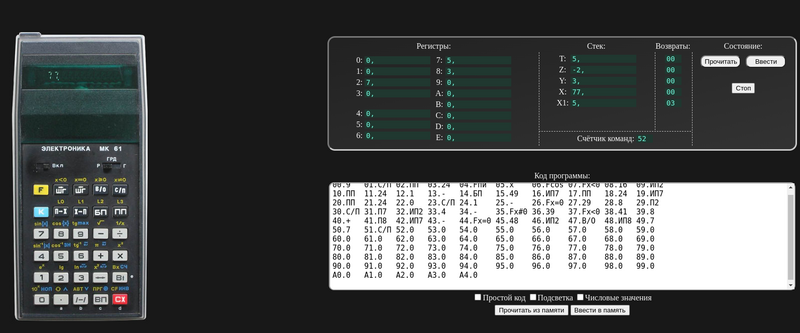
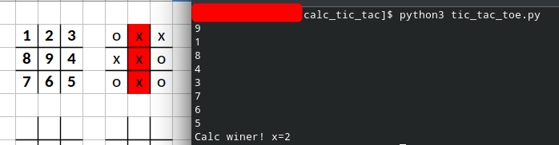

# Крестики-нолики для калькулятора __МК-61__ и __HP-32S__

Игра крестики-нолики из книги "Калькулятор - твой помощник и соперник в играх" А. Г. Гайштут.  Глава, посвящённая крестикам ноликам приведена в файле [tic_tac_toe.pdf][pdf]

Для удобства программы перенесена в [Exel][exel]. Там содержится программа для калькулятора __МК-61__ и для __HP-32S__.

Можно попробовать [код для калькулятора МК-61][calc61] в [эмуляторе][emul61]. 

Чтобы понять принцип работы программы, [переписал на языке python][python]. Программа работает аналогично программе на МК-61, отличие только в условиях. На МК-61 переход осуществляется при ложном условии. Также немного более красиво сделал победу и поражение. Можно было добавить графики, но это бы переусложнило код.

На __HP-32S__ аналогично всё корректно работает. Добавлены отдельные процедуры ввода данных и победы. Есть небольшая ошибка в некорректности вывода последнего хода калькулятора, пока место ошибки не определено.

*здесь фотография HP-32S*

   [pdf]: <files/tic_tac_toe.pdf>
   [exel]: <files/tic_tak_toe_programs.xlsx>
   [calc61]: <mk61_emu.txt>
   [emul61]: <https://pmk.arbinada.com/mk61emuweb.html>
   [python]: <tic_tac_toe.py>
